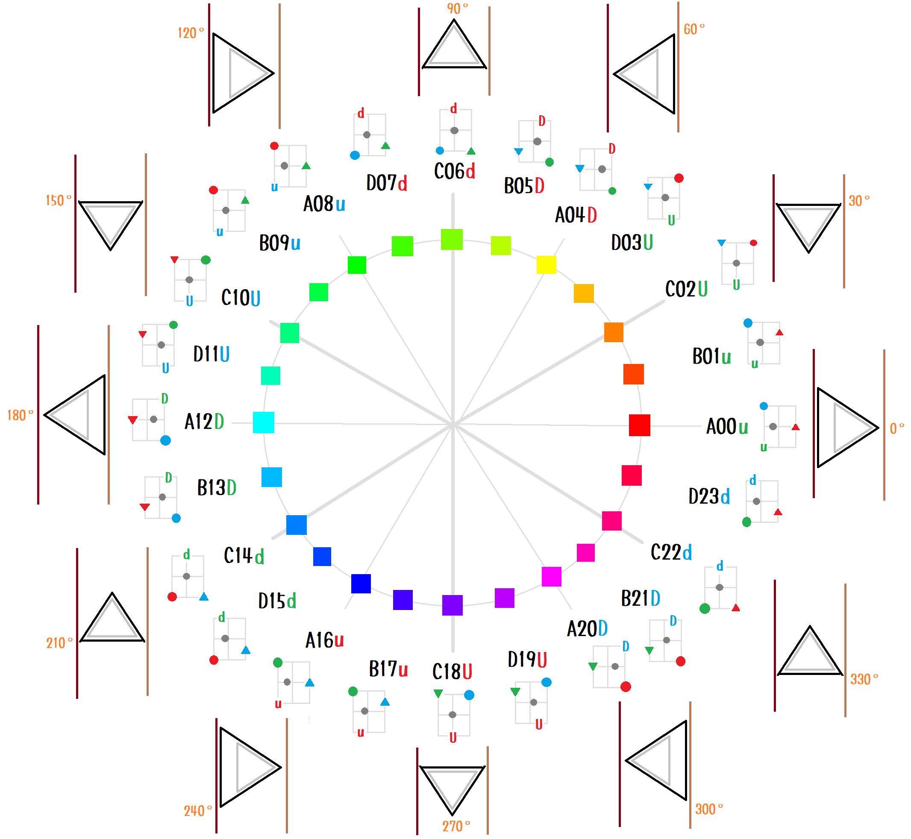

# practice-open-cv2

  
(上図は 騙し絵(Fake)の一種、良く言えば近似(Approximate)。  
内側の、円に内接する白い正三角形と、外側の、長方形に内接する正三角形は、  
角度が同じように見えて ずれています。
どこを測るか計算の仕方によるものの、良く言って ラジアン値で 0.02未満、 弧度法で 0.7°未満 のずれ。   
⚡📄`c_step28/make_frames.py` と ⚡📄`e_step4/pygame00.py` 使用)  

## HULビューって何？

ざっくり言うと HSVモデルを図形で説明（View）する試みの１つで、それに失敗したのが HULビューです。
HSVモデルは、色相(H)と、色調（彩度(S)、明度(V)）を扱う色空間モデルです。

HULビューでは、Hue(色相環の角度、弧度法)、Upper(上限値)、Lower(下限値) から
円に内接する正三角形を回転させることで HSVモデルを説明するビューです（説明には失敗）。

## HSVモデルと、HULビューの同じところ

* (1) HSVモデルの `H` は、 HULビューも同じ `H`。  
* (2) HSVモデルの `S` は、 HULビューの `U - L` 。  
* (3) HSVモデルの `V` は、 HULビューも同じで、呼び方だけ違う `U` 。  

### (1)

RGB値の比で 色相環の角度、Hue(H) を表す。  
HULビューは それと同じことを 円に内接する正三角形の回転という別の言い回しで説明しているだけ。  

### (2)

HSVモデルは 彩度(S) で表す。  
HULビューは それと同じことを 上限値(U) - 下限値(L) で表す。  

### (3)

HSVモデルは 明度(V) で表す。  
HULビューは それと同じことを RGB値のバーの 上限値(U) という別の言い回しで説明しているだけ。  

## HSVモデルと、HULビューの違うところ

HSVモデルの精度が 実数 なのに対し、 HULビューの精度は 弧度法の整数部の0を含む自然数 0～365 （精度の劣化）。

## HULビューのソースの使い方

GPLライセンスのライブラリが含まれてるから、プログラムは個別にライブラリのライセンスを要確認（＾～＾）  
HULビューはアルゴリズムなんで 著作権無いんで理解したら独自実装し直して持ってけだぜ（＾～＾）  

* 📁`c_step28` - わたしの考えたHULビューのエキシビジョン（＾～＾）
  * 📄`make_frames.py` - 実行しろだぜ（＾～＾）1フレームごとの画像ファイルを 📁`shared` に大量に作るぜ（＾～＾）
  * ⚙️📄`conf.py` - いろいろな設定
  * ⚡📄`color_hul_model.py` - わたしのHULビューをGPLで実装したやつ（＾～＾） ソースはGPLで使いにくいだろうから、それが嫌なやつはアルゴリズムだけ理解して自力実装し直せだぜ（＾～＾）
* 📁`e_step4` - c_step28で作った1フレームごとの画像を紙芝居にして動画で流すやつ。
  * ⚡📄`pygame00.py` - `FRAME_COUNT` グローバル変数を出力された画像の枚数に設定しろだぜ（＾～＾） 実行しろだぜ（＾～＾）
* 📁`shared` - c_step28 を実行したら、画像が大量に出力されるぜ（＾～＾）

## Set up

```shell
pip install opencv-python
pip install pylint
python -m pylint --generate-rcfile > pylintrc

python -m pip install -U pygame --user

# 注意！ 音が出るゲーム画面が出る
python -m pygame.examples.aliens
```

VSCode `[File] - [Preferences] - [Settings]`。 検索欄に `Python.linting.pylintArgs` を入れて検索。 `--extension-pkg-whitelist=cv2,pygame` を追加。  

## Start

```shell
cd c_step28

python make_frame.py

cd e_step4

python pygame00.py
```

## c_step28 図解


## Document

[References](./@doc/references.md)  
